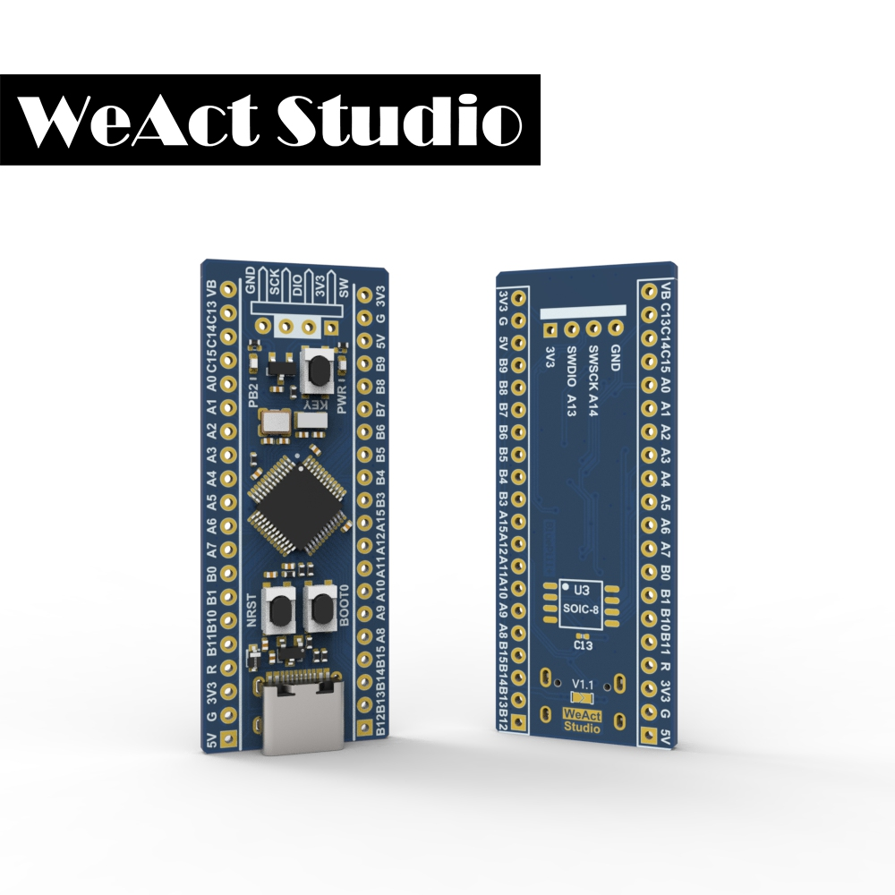

* [Enlish version](./README.md)
# WeActStudio.BluePill-Plus-GD32
GD32F103CBT6
> 108Mhz Max,20KB RAM,128KB ROM

GD32 官方网站 www.gd32mcu.com



## 特性
* GD32F103CBT6 ARM Cortex-M3
+ `108 MHz` 最大运行频率
+ `128 Kbytes` of Flash memory, `20 Kbytes` of SRAM
* `8 MHz` 系统晶振
* `32.768 KHz` RTC晶振
* 用户按键 KEY `PA0`
* 蓝色 LED `PB2` Active high
* 红色电源 LED `PWR`
* 2x20 侧面引脚 && 1x4 SWD 引脚
* 尺寸: `52.81 mm x 20.78 mm`

* SPI Flash U3 IO位置
  * PA4  CS
  * PA6  MISO
  * PA7  MOSI
  * PA5  SCK
* USB C
  * PA11  USB_DN
  * PA12  USB_DP
* SWD Debug
  * PA13  SWDIO
  * PA14  SWCLK

|目录名称|内容|
| :--:|:--:|
|Doc| 数据手册/参考手册|
|HDK| 硬件开发资料|
|SDK|软件开发资料|
|Examples|软件例程|

```
/*---------------------------------------
- WeAct Studio 官方链接
- taobao: weactstudio.taobao.com
- aliexpress: weactstudio.aliexpress.com
- github: github.com/WeActTC
- gitee: gitee.com/WeAct-TC
- blog: www.weact-tc.cn
---------------------------------------*/
```